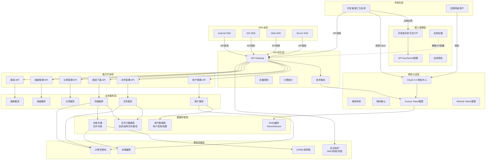

# 百度网盘开放平台业务架构图



## 架构分层说明

### 1. 外部生态层
| 角色 | 职责 |
|------|------|
| 开发者/第三方应用 | 调用API，集成网盘能力 |
| 百度网盘用户 | 授权第三方应用访问其网盘数据 |

### 2. 接入管理层
| 模块 | 功能 |
|------|------|
| 应用创建 | 创建应用，获取 AppID 和 AppKey |
| API Key/Secret管理 | 管理应用密钥，用于接口调用认证 |
| 应用审核 | 提交审核，正式接入开放平台 |

### 3. 授权认证层
| 模块 | 功能 |
|------|------|
| OAuth 2.0 授权中心 | 基于OAuth 2.0协议进行用户授权 |
| 授权申请 | 第三方应用申请用户授权 |
| 授权确认 | 用户确认授权范围 |
| Access Token管理 | 生成、验证、刷新Access Token |
| Refresh Token管理 | 用于刷新过期的Access Token |

### 4. API 网关层
| 模块 | 功能 |
|------|------|
| 请求鉴权 | 验证请求的合法性（Token验证、签名验证） |
| 流量控制 | 限制单个应用的调用频率 |
| 计费统计 | 统计API调用次数，用于计费分析 |

### 5. 能力开放层
| API类型 | 提供能力 |
|---------|----------|
| 用户管理 API | 用户信息获取、权限查询 |
| 文件管理 API | 文件上传、下载、删除、重命名、移动 |
| 离线下载 API | 添加离线下载任务、查询任务状态 |
| 分享管理 API | 创建分享、查询分享、取消分享 |
| 相册管理 API | 相册创建、相册内容管理 |
| 搜索 API | 文件搜索、标签搜索 |

### 6. 业务服务层
| 服务 | 功能 |
|------|------|
| 用户服务 | 用户信息管理、权限控制 |
| 文件服务 | 文件元数据管理、目录操作 |
| 传输服务 | 文件上传下载、断点续传 |
| 分享服务 | 分享链接生成、访问控制 |
| 相册服务 | 相册管理、图片处理 |
| 搜索服务 | 全文搜索、智能推荐 |

### 7. 数据存储层
| 存储 | 用途 |
|------|------|
| 用户数据库 | 存储用户信息、授权关系、应用配置 |
| 文件元数据库 | 存储目录结构、文件属性、索引 |
| 对象存储 | 存储实际文件内容 |
| Redis缓存 | 缓存Token、Session、热点数据 |

### 8. 基础设施层
| 设施 | 作用 |
|------|------|
| CDN分发网络 | 加速文件下载、分享链接访问 |
| 存储集群 | 提供海量、可靠的存储服务 |
| 计算资源池 | 提供弹性计算能力 |
| 安全防护 | WAF防护、反爬虫、风控策略 |

### 9. SDK支持
| SDK类型 | 平台 |
|---------|------|
| Android SDK | Android移动应用 |
| iOS SDK | iOS移动应用 |
| Web SDK | Web前端应用 |
| Server SDK | 后端服务 |

## 业务流程示例

### OAuth授权流程
```
1. 第三方应用 → 引导用户跳转授权页面
2. 用户 → 确认授权
3. 百度网盘开放平台 → 返回授权码
4. 第三方应用 → 用授权码换取Access Token
5. 百度网盘开放平台 → 返回Access Token
6. 第三方应用 → 使用Token调用API
```

### API调用流程
```
1. 第三方应用 → 携带Token调用API
2. API Gateway → 验证Token有效性
3. API Gateway → 调用对应业务服务
4. 业务服务 → 操作数据存储
5. API Gateway → 返回结果给第三方应用
```